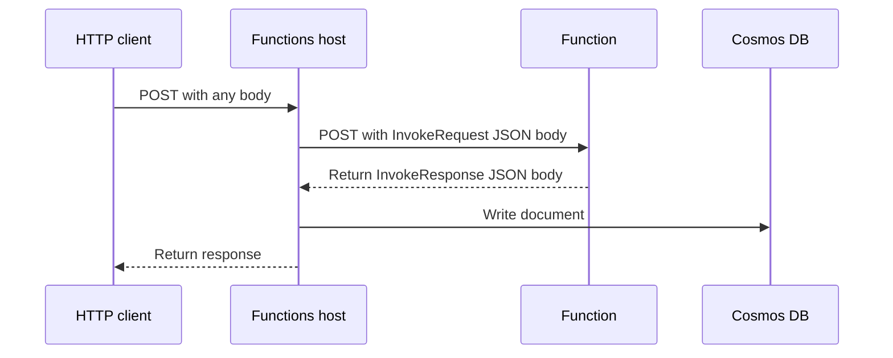

# go-azure-function
This is a demo project that shows how an Azure Function can be written in Go and deployed.

The Github Actions workflow contains this functionality:
* on each pull request update or push, the code is compiled, deployed to Azure and tested with Postman
* each pull request gets its own function app that is removed when the pull request is closed
* pushes to main do a production deployment (after the test job has finished successfully)

The function writes a document to Cosmos DB using an output binding.

Many things are probably needed before using this in production, such as:
* authentication (if needed)
* use of Application Gateway or Front Door instead of direct access to the function
* a plan for the storage account and function app that provides the desired availability and performance
* use of a deployment slot in the production job for blue-green deployment
